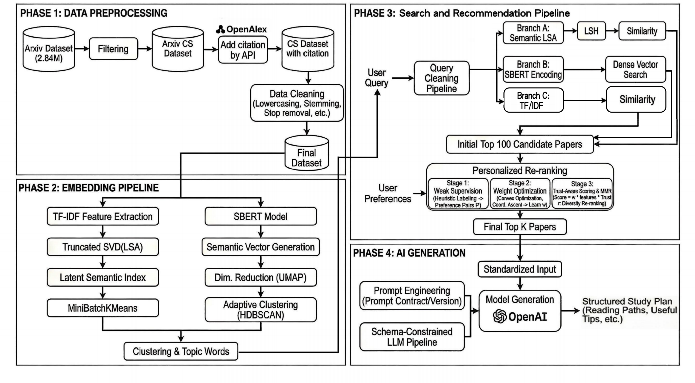
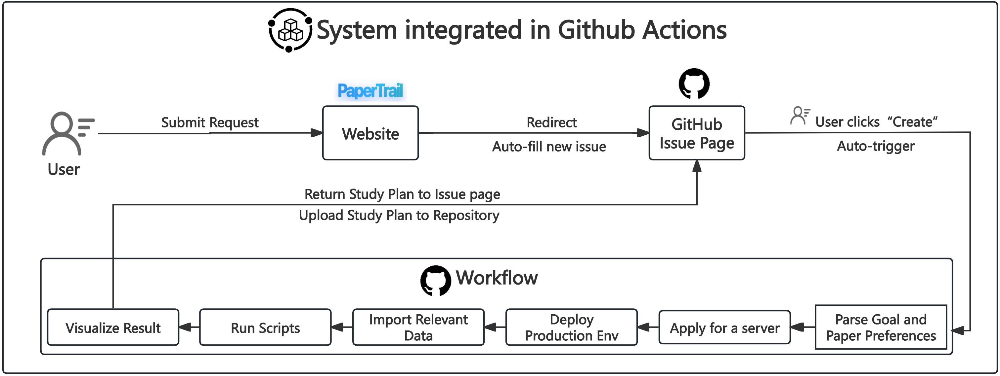

<div align="center">
    
    <br/>
    <h3>Intelligent Literature Exploration & Learning Plan Generator</h3>
    <p>
        <a href="https://xinhuangcs.github.io/PaperTrail/"><strong>🌐 website</strong></a>  | 
        <a href="https://github.com/xinhuangcs/PaperTrail/issues"><strong>🐛 Report Bug</strong></a>
    </p>
    <p>
        <em>Final Project for DTU 02807 Computational Tools for Data Science</em>
    </p>
</div>

---

## 📖 Table of Contents
* [1. Introduction](#1-introduction)
* [2. Features](#2-features)
* [3. Data Source](#3-data-source)
* [4. Technical Architecture ](#4-technical-architecture)
* [5. Version History & Iteration](#5-version-history--iteration)
* [6. Usage Guide 🚀](#6-usage-guide-)
    * [6.1 User Mode](#61-user-mode-web-interface)
    * [6.2 Developer Mode: Start directly using our pre-calculated results](#62-developer-mode-start-directly-using-our-pre-calculated-results)
    * [6.3 Developer Mode: Starting with initial dataset filtering](#63-developer-mode-starting-with-initial-dataset-filtering)
    * [6.4 Developer Mode: Running Jupyter Notebooks](#64-developer-mode-running-jupyter-notebooks)

---
## 1. Introduction
**PaperTrail** leverages topics from the **DTU 02807 Data Science Computing Tools** course, including similar-item search/locality-sensitive hashing, high-frequency item mining, and general clustering algorithms.  
It further integrates hybrid search methods(TF-IDF, LSA, and SBERT) and intelligent re-ranking algorithms (weak supervision, MMR).  
Based on these techniques, PaperTrail recommends paper sets tailored to user preferences and then uses large language models to generate personalized, step-by-step learning plans.

Our overall implementation logic is as follows:
<p align="center">
  
</p>  
To build the project website quickly and enable users to start using PaperTrail promptly, we've set up the project pages using GitHub Pages and integrated the system within GitHub Actions. The primary implementation logic is as follows:
<p align="center">
  
</p>

---
## 2. Features
📚 **Large-Scale Corpus**: Indexing over 700,000+ CS papers from arXiv.  
⚡  **Hybrid Search**: Explored multiple approaches including keyword matching (TF-IDF) and semantic understanding (LSA & SBERT), with LSH acceleration applied to portions of the code.  
🧠 **Smart Recommendation**: Uses weak supervision and MMR (Maximal Marginal Relevance) to rank papers by pedagogical value.  
🎯 **LLM-Powered Plans**: Generates JSON-structured study plans including reading order, key questions, and timelines using GPT-4/5.  
🔧 **Automated Workflow**: Fully integrated with GitHub Actions—request a plan via the Github pages, and get the result delivered to a GitHub Issue.  

---
## 3. Data Source
The project uses the [arXiv Dataset](https://www.kaggle.com/Cornell-University/arxiv). We also provide the [processed dataset](https://github.com/xinhuangcs/PaperTrail/releases) for direct use.
* **Original Size**: ~2.84M papers\*.
* **Filtering**: We filter for categories starting with `cs.` (Computer Science), `stat.` (Statistics), and `eess.` (Electrical Engineering and Systems Science), etc.
* **Add citation data**: Use the OpenAlex API to add citation data to papers.
* **Final Dataset**: Contains ~730,000 papers used for the search index\*.
* **Preprocessing**: Text cleaning, stop word removal, and stemming are applied before indexing.  

<small>
* Our dataset was downloaded on September 26, 2025, and the statistics are based on this date.  <br>  
</small>

<small>
* When we expanded our citation data, we discovered that OpenAlex has not yet indexed some publications released since 2025. Therefore, our dataset currently only includes papers published up to the end of 2024.
</small>

---
## 4. Technical Architecture
The project structure follows the data processing pipeline:
```text
PaperTrail/
├── data/                   # Data storage (Artifacts like matrices, models)
├── scripts/
│   └── run_pipeline.py     # Script: Search -> Recommend -> Plan
├── src/
│   ├── preprocess_data/    # 1. Data Cleaning & Filtering
│   ├── tf_idf/             # 2. Feature Extraction (TF-IDF)
│   ├── lsa_and_clustering/ # 3. Dimensionality Reduction & Clustering
│   ├── search/             # 4. Similarity Search Engines
│   ├── recommend/          # 5. Re-ranking Logic/Recommadation Algorithm
│   └── ai_advice/          # 6. LLM Generation
├── website/                # Frontend
└── .github/workflows/      # CI/CD
````

---
## 5. Version History & Iteration 

### 5.1 Data Preprocessing & Features 
Located in `src/preprocess_data/`, `src/tf_idf/`, `src/lsa_and_clustering/`.   
- **Preprocessing**:
    - `(0_0_data_analysis)`: Analyze the full ArXiv dataset (2.8M papers), category distribution, and data structure.
    - `(0_1_reduce_categories)`: Reduce 2.8M papers to a manageable subset relevant to CS.
    - `(1_0_add_incite_num)`: dd citation counts from OpenAlex using DOI and Title matching (sliced execution).
    - `(1_1_merge_slices)`: Merge distributed processing slices into a unified dataset.
    - `(1_2_retry_record_of_negone)`: Fix missing citation data using a multi-stage fallback strategy (Truncated Title/Abstract search).
    - `(2_data_filtering)`: Normalize text data and prepare `processed_content` for embedding/indexing.
- **TF-IDF**:
    - `(build_tfidf.py)`: Runs scikit-learn `TfidfVectorizer` on `processed_content` to export the sparse matrix, fitted vectorizer, and document metadata.
    - `(build_tfidf_manual.py + my_tfidf.py)`: Manually implement TF-IDF for experimentation.
    - `(val.py)`: Validates parity between the sklearn and manual implementation (matrix, vectorizer, doc ids/titles) with strict numerical tolerances.
    - `(check_tfidf.py)`: Reloads saved artifacts and surfaces top-weighted terms per document for sanity checks.
    - `(query_tfidf.py)`: CLI utility that stems a free-text query, transforms it with the stored vectorizer, and returns top-K cosine matches from the TF-IDF matrix.
- **Clustering**:
    - `v1 (build_lsa.py + lsa_cluster.py)`: Baseline LSA pipeline: reduce TF-IDF with `TruncatedSVD` (1k dims) and run vanilla `KMeans` (k=15) to obtain topic IDs.
    - `v2 (lsa_variance_check.py + lsa_cluster_v2.py + cluster_labels.py + evaluate_clusters.py)`:  
      Iteration on v1: added variance probing to select optimal LSA dimensions, switched to `MiniBatchKMeans` (k=40) with silhouette score reporting, implemented back-projection of cluster centroids to readable keywords (augmented with UMAP+HDBSCAN for subtopic mining), and integrated Davies–Bouldin / Silhouette / Calinski–Harabasz metrics.
    - `(sbert_hdbscan_cluster_lite.py / sbert_hdbscan_lite.py)`:  
     Implement SBERT embeddings + optional UMAP, automate HDBSCAN hyperparameter search/logging, persist embeddings/clusterers, and derive Apriori-based topic labels that handle noise while scaling to 70k+ documents.
### 5.2 Search Module 
- **v1 (`similarity_search.py`)**:  Interactive baseline that loads the full TF-IDF matrix or LSA projection and performs cosine search (O(N) per query). 
- **v2 (`export_artifacts_v2.py` + `similarity_search_v2.py`)**:  Split the workflow into an artifact exporter (vocab, IDF, SVD components, TF-IDF row norms, pre-normalized LSA) and a lightweight query runner.
- **v3 (`similarity_serach_v3.py`)**:  Iterated on v2 with richer context: custom stopwords + stemming, cluster IDs/topics attached to every hit, and an LSA-LSH mode that hashes papers into random hyperplane buckets before exact ranking. 
- **v4 (`similarity_search_v4.py`)**:  Productionized v3 for automation (argparse CLI, non-interactive), added verbose query diagnostics, and introduced fallbacks.
- **SBERT (`similarity_search_sbert.py`)**:  Parallel search path that reuses the SBERT + HDBSCAN artifacts to encode queries with `all-MiniLM-L6-v2`, retrieve via cosine similarity, and surface HDBSCAN cluster topics when available.
### 5.3 Recommend Module
Located in `src/recommend/`.
- **v1 (`recommend.py`)**:  Introduced heuristic scoring that linearly combines semantic similarity (from retrieval) with citation counts, recency, and keyword matching. Supports different modes like "theoretical", "application", "review", and "trending" to adjust weights .
- **v2 (`recommend_v2.py`)**:  **Pipeline Integration**: Improved upon v1 by automating the input flow—it automatically detects and loads the latest search artifact (`similarity_for_recommend_lsa_*.json`) instead of requiring hardcoded paths, enabling a seamless transition from search to ranking.
- **v3 (`recommend_v3.py`)**:
    **Adaptive Ranking**: Replaced v1/v2's fixed heuristics with a "weak supervision" approach. It generates pseudo-labels based on paper features (e.g., title keywords, citation velocity) and trains pairwise logistic regression weights to learn optimal scoring for each view.
    **Diversity (MMR)**: Added Maximal Marginal Relevance to penalize redundancy, ensuring the top results cover diverse subtopics rather than repeating the same dominant cluster.
    **Dynamic Intent**: Can infer user preferences from the query or mix weights probabilistically for a balanced "default" view.
### 5.4 AI Advice Module 
Located in `src/ai_advice/`.
- **v1 (`v1/advice.py`)**: Prototype implementation that directly feeds paper metadata into the LLM (GPT-5). It relies on unstructured textual prompts to elicit reading advice but produces free-form output that is difficult to parse reliably for downstream applications.
- **v2 (`v2/generate_plan.py`)**:
    - Introduced JSON Schema enforcement (`schema_contract.py`) to compel the LLM to output a strict `LearningPlan` object (timeline, prerequisites, ordered reading list).
    - Added a retry mechanism (`call_with_retries`) that handles transient API errors and schema validation failures, ensuring the frontend always receives renderable JSON.
    - Pre-processes raw recommendations into a token-efficient format (`standardize_input.py`) before prompting (`prompts.py`), optimizing context window usage and cost.
    - Further refinement of the (`generate_plan_v3.py`) script to better handle edge cases and enhance logging.


    


---

## 6. Usage Guide 🚀
**PaperTrail provides four usage modes:**

6.1 [**User Mode (Web Interface)**](#61-user-mode-web-interface) - No setup, get instant results **online**.  
6.2 [**Developer Mode (Fast Run)**](#62-developer-mode-start-directly-using-our-pre-calculated-results) - Run **locally** using pre-computed data.  
6.3 [**Developer Mode (Full Pipeline)**](#63-developer-mode-starting-with-initial-dataset-filtering) - Run **locally** from zero.  
6.4 [**Developer Mode (Jupyter Notebooks)**](#64-developer-mode-running-jupyter-notebooks) - Interactive exploration of the pipeline **step-by-step**.  


### 6.1 User Mode (Web Interface)
👉🏻 You don't need to install any code.  ([**How it works?**](#1-introduction))  
👉🏻 You don't need to pay for AI API fee (We have integrated our OpenAI's API key into the system for your free use).
1. Go to the [**PaperTrail**↗](https://xinhuangcs.github.io/PaperTrail/) Website.
2. Enter your learning objectives (e.g., “I want to learn about diffusion models”) and paper preferences.
3. Click **Generate**.
4. This will redirect you to open a **GitHub Issue**. Submit it to trigger the backend pipeline.
5. Wait ~3-5 mins for the bot to comment with your generated plan.


### 6.2 Developer Mode: Start from using our pre-computed results
**👉🏻 Best for:** Developers who want to run the search, recommend and generation pipeline locally, without waiting days for data processing and computing.   
**⏱️ Estimated runtime (excluding downloads):** \~2 minutes  

We provide pre-computed results in our **[GitHub Releases](https://github.com/xinhuangcs/PaperTrail/releases/tag/data-papertrail-v2)**.  
_We recommend using **PaperTrail-Data-v2**, which offers better search performance but requires more storage space and memory.   
Due to Github Action server limitations, our website utilizes the lightweight version of **PaperTrail-Data-v3**._


0.  **Prerequisites**:
      * Python 3.12+
      * OpenAI API Key (`export OPENAI_API_KEY='sk-...'`)

1.  **Setup Environment**:
    ```bash
    pip install -r requirements.txt
    ```
2.  **Download Data**:

      * Download the artifacts from the **[GitHub Releases](https://github.com/xinhuangcs/PaperTrail/releases/tag/data-papertrail-v2)** (Recommend: `data-action-v2`; Only 4 files from `papertrail_data.tar.gz.aa` to `papertrail_data.tar.gz.ad`).
      * Extract them and put the `data/` directory in your project root.
    ```bash
    cat papertrail_data.tar.gz.* > papertrail_data.tar.gz
    tar -xzf papertrail_data.tar.gz
    ```

3.  **Run the Pipeline**:
    ```bash
    # This runs: Search (v4) -> Recommend (v3) -> Standardize -> Generate Plan (v2)
    python scripts/run_pipeline.py \
      --goal "Graph Neural Networks" \ 
      --top_k 10 \
      --method lsa_lsh \
      --mode review \
      --issue "local_test_run"
    #goal:what do u want to learn;  top_k:How many paper do you want? ; method: method of search; mode: paper types
    ```

### 6.3 Developer Mode: Starting from initial dataset filtering
**👉🏻 Best for:** Developers who want to run our code from the start using the latest data.  
**⏱️ Estimated runtime (excluding data-download time):** more than 200 Hours
  * **\>200 Hours**: Get the newest original [ArXiv Dataset](https://www.kaggle.com/Cornell-University/arxiv) and call OpenAlex API to insert citation data.  
   * **\<10 Hours**: For data cleaning, feature extraction, and indexing of the \~700k CS papers.  
     (You can also download our [preprocessed dataset](https://github.com/xinhuangcs/PaperTrail/releases/tag/data-papertrail-v1) and start from Step 4 to save time.)

0.  **Prerequisites**:
      * Python 3.12+
      * OpenAI API Key (`export OPENAI_API_KEY='sk-...'`)

1.  **Setup Environment**:
    ```bash
    pip install -r requirements.txt
    ```
    
2.  **Download Data**: Get the newest original [ArXiv Dataset](https://www.kaggle.com/Cornell-University/arxiv) and place `arxiv-metadata-oai-snapshot.json` in `data/preprocess/`.

3. **Filter & Enrich & Data Cleaning** (The time-consuming step):
    ```bash
    pip install -r requirements.txt
    python src/preprocess_data/0_1_reduce_categories.py
    python src/preprocess_data/1_0_add_incite_num.py
    python src/preprocess_data/1_2_retry_record_of_negone.py
    # Note: The citation enrichment script will takes >200h.
    python src/preprocess_data/2_data_filtering.py
    ```
    
4.  **Compute Data for Search-Recommend-Generate Pipeline**:
    ```bash
    # 1. TF-IDF
    python src/tf_idf/build_tfidf.py

    # 2. LSA Reduction and Clustering (K-Means)
    python src/lsa_and_clustering/build_lsa.py        # Generates LSA matrix
    python src/lsa_and_clustering/lsa_cluster_v2.py   # Generates K-Means clusters

    # 3. SBERT Embedding & HDBSCAN Clustering (Optional)
    python src/lsa_and_clustering/sbert_hdbscan_lite.py
    # Export artifacts for fast loading
    python src/search/export_artifacts_v2.py 
    
    # Test Search Engines (Optional)
    python src/search/similarity_search_v4.py --query "graph neural networks" --method lsa_lsh
    python src/search/similarity_search_sbert.py
    ```

5.  **Run Pipeline**:
    ```bash
    python scripts/run_pipeline.py --goal "Graph Neural Networks" --top_k 10 --method lsa_lsh --mode review --issue "local_test_run"
    ```

### 6.4 Developer Mode: Running Jupyter Notebooks
**👉🏻 Best for:** Developers who want to explore the pipeline interactively, understand each step in detail, and experiment with different configurations.  
**⏱️ Estimated runtime:** Varies by notebook (from minutes to hours depending on data size)

The `jupyter_notebook/` directory contains interactive notebooks that walk through each stage of the PaperTrail pipeline:

* `1_preprocess_data.ipynb` - Data preprocessing and filtering
* `2_Clustering.ipynb` - TF-IDF, LSA, K-Means, and SBERT/HDBSCAN clustering analysis
* `3.1_search.ipynb` - Similarity search implementations (TF-IDF, LSA+LSH, SBERT)
* `3.2_recommendation_system.ipynb` - Recommendation and re-ranking algorithms
* `4_AI_generation.ipynb` - AI-powered learning plan generation
* `5.1_eval_lsa.ipynb` - Evaluation metrics for LSA-based clustering
* `5.2_eval_hdbscan.ipynb` - Evaluation metrics for HDBSCAN clustering

**Prerequisites**:
* Python 3.12+
* Jupyter Notebook or JupyterLab installed
* All dependencies from `requirements.txt`

**Setup and Run**:

1. **Install Jupyter** (if not already installed):
    ```bash
    pip install jupyter jupyterlab
    ```

2. **Navigate to the notebooks directory**:
    ```bash
    cd jupyter_notebook
    ```

3. **Run notebooks in order**:
    Start with `1_preprocess_data.ipynb` if you want to explore data preprocessing

**Note**: Some notebooks require pre-computed data artifacts. You may need to either:
* Download pre-computed results from [GitHub Releases](https://github.com/xinhuangcs/PaperTrail/releases) and place them in the `data/` directory, or Run the corresponding Python scripts to generate the required artifacts.

**Due to huge raw dataset, Here, we manually constructed a minimal dataset to test whether Jupyter can run.**

---
## 🙏 Acknowledgements
- We gratefully acknowledge **[arXiv](https://arxiv.org/)** for providing the open-access metadata.
- Citation data is powered by **[OpenAlex](https://openalex.org/)**. We verify our data enrichment process complies with their usage policy (Polite Pool).
## 📄 License
- **Code**: Licensed under the **Apache License 2.0**.
- **Data**: The enriched dataset is released under **CC0 1.0 Universal**, consistent with its sources (arXiv & OpenAlex).
